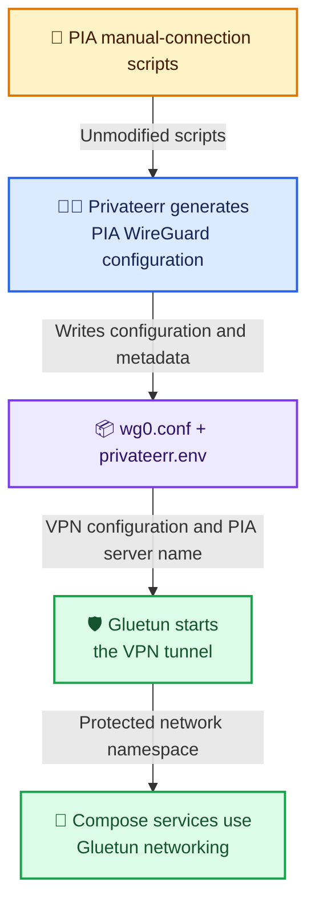

<!-- markdownlint-disable-next-line MD033 MD041 -->
<hr />

<!-- markdownlint-disable MD033 -->
<p align="center">
  <em>🦜 Parrot says: Found this useful? Drop a ⭐ an' help another crew find the map.</em>
</p>

<p align="center">
  <a href="https://github.com/scottgigawatt/privateerr/stargazers"></a>
  <a href="https://github.com/scottgigawatt/privateerr/forks"></a>
  <a href="https://github.com/scottgigawatt/privateerr/watchers"></a>
</p>

<p align="center">
  
  
  <a href="./LICENSE"></a>
</p>

<p align="center">
  <a href="https://github.com/scottgigawatt/privateerr/releases/latest"></a>
  
  <a href="https://www.bestpractices.dev/projects/13442"></a>
</p>

<p align="center">
  <a href="https://github.com/scottgigawatt/privateerr/actions/workflows/build-and-push.yml"></a>
  <a href="https://hub.docker.com/r/scottgigawatt/privateerr"></a>
  <a href="https://github.com/scottgigawatt/privateerr/pkgs/container/privateerr"></a>
  <a href="https://github.com/scottgigawatt/privateerr/actions/workflows/build-and-push.yml"></a>
</p>

<p align="center">─── ⛧ ───</p>

<p align="center">
  <em>💀 Questions or cursed code? Step forward… <strong>enter 🔥HADES🔥</strong>.</em>
</p>

<p align="center">
  <a href="https://discord.gg/BpEGzWwGYf"></a>
</p>
<!-- markdownlint-enable MD033 -->

<!-- markdownlint-disable-next-line MD033 -->
<hr />

# Privateerr 🏴‍☠️

Privateerr is a containerized configuration tool for [Private Internet Access (PIA)](https://www.privateinternetaccess.com/). It packages PIA's official, unmodified [manual-connection scripts](https://github.com/pia-foss/manual-connections) in a small Alpine container and uses them to generate a WireGuard configuration file plus PIA server metadata for automation.

Use Privateerr when you want `wg0.conf` for Gluetun, WireGuard, or another compatible VPN client—especially when a Docker Compose deployment needs to generate that configuration repeatably.

> [!IMPORTANT]
> Privateerr is not a virtual private network (VPN) client. It does not create or maintain a tunnel. It generates `wg0.conf` for a VPN client such as Gluetun or WireGuard.

The upstream PIA scripts remain visible as the `docker/pia-manual-connections` submodule. Privateerr adds repeatable container execution, safe defaults, health reporting, and a small metadata handoff without modifying those scripts.

## Understand the data flow 🧭

Privateerr runs before the VPN client and writes two files. Gluetun—a separate VPN client container—uses `wg0.conf` to establish the tunnel and reads `PIA_WG_SERVER_NAME` from `privateerr.env` when PIA port forwarding is enabled. Other Compose services can then share Gluetun's protected network connection.



## Generate a WireGuard configuration ⚡

Before you begin, you need an active PIA subscription plus Git, Docker with Docker Compose, and Make. Clone the repository with its PIA submodule, create the private environment file, and edit the PIA values before running Privateerr:

```sh
git clone --recurse-submodules https://github.com/scottgigawatt/privateerr.git
cd privateerr
cp example.env .env
```

The public PIA submodule needs no GitHub SSH key. If cloning reports a submodule error or building reports a missing `pia-manual-connections/LICENSE`, follow [Recover a missing PIA submodule](docs/SUPPORT.md#recover-a-missing-pia-submodule).

Set `PIA_USER` and `PIA_PASS` in `.env`. The example sets `PIA_PF=true` to select a region supporting port forwarding for qBittorrent. The example enables automatic recovery: generate a key with `openssl rand -hex 24` and set `PRIVATEERR_GLUETUN_API_KEY` in `.env`. `make run-privateerr` disables recovery and keepalive for that one-shot run without changing `.env`. Stop any running supervisor before generating into its configuration directory. Keep the file private, then generate fresh configuration:

```sh
make run-privateerr
```

Privateerr writes:

| 📦 Output | 📍 Path | 🎯 Used by |
| --- | --- | --- |
| 🛡️ WireGuard configuration | `config/gluetun/wireguard/wg0.conf` | Gluetun, WireGuard, or another compatible VPN client |
| 🧭 PIA server metadata | `config/gluetun/wireguard/privateerr.env` | Compose automation that needs the selected endpoint, region, or port-forwarding details |

> [!WARNING]
> Keep live `wg0.conf` and `privateerr.env` files private. They can contain VPN connection material and deployment-specific metadata. Run `make restore-test-config` before committing after a live voyage.

<!-- markdownlint-disable MD033 -->
<details>
<summary>View abbreviated example output</summary>

The checked-in examples use fake pirate-flavored data. A real run overwrites them.

```text
[Interface]
Address = 10.10.10.10
PrivateKey = EXAMPLE-PRIVATE-KEY
DNS = 10.10.10.10

[Peer]
PersistentKeepalive = 25
PublicKey = EXAMPLE-PUBLIC-KEY
AllowedIPs = 0.0.0.0/0
Endpoint = 10.10.10.10:1234
```

```text
PIA_WG_SERVER_NAME=jolly-roger-401
PIA_WG_ENDPOINT_IP=10.10.10.10
PIA_WG_ENDPOINT_PORT=1234
PIA_REGION_ID=skull-island
PIA_REGION_NAME="Skull Island"
PIA_PORT_FORWARDING_SUPPORTED=true
PIA_GEOLOCATED_REGION=false
```

</details>
<!-- markdownlint-enable MD033 -->

## Select a PIA region 🧭

Automatic selection remains enabled by default. To use a selected region, set these values in `.env`, then recreate the stack with `make up`:

```dotenv
PIA_AUTOCONNECT=false
PIA_PREFERRED_REGION=ca
```

`PIA_PREFERRED_REGION` defaults to `ca`, matching Plundarr. Replace it with another PIA region ID when needed. `PIA_AUTOCONNECT=true` overrides the preferred region.

## Recover stale VPN connections ⚓

Privateerr can optionally monitor Gluetun and refresh stale PIA WireGuard settings through Gluetun's authenticated control API. It keeps Gluetun's container running and needs no extra service or Docker socket. The supplied environment example enables recovery by default. Set a private shared API key before starting; image-only deployments that omit the setting retain their existing behavior.

See [automatic Gluetun recovery](docs/automatic-recovery.md) for setup, API authentication, timing, and limitations. Gluetun remains responsible for the VPN tunnel and port forwarding. The example runs Privateerr without privileged mode or Linux capabilities; see [container hardening and image-only upgrades](docs/automatic-recovery.md#run-without-privileged-mode).

## Enable PIA port forwarding 🚪

Set `PIA_PF=true` in `.env`, then regenerate the files:

```sh
make run-privateerr
```

Privateerr asks PIA for a port-forwarding-capable WireGuard endpoint and writes the matching server name to `privateerr.env`. The included Gluetun wrapper exports that value as `SERVER_NAMES` before starting Gluetun, allowing Gluetun to request the forwarded port from the correct PIA server.

If you only need a WireGuard file, take `wg0.conf` and use it with the compatible client of your choice. If you want the complete automated handoff, use the included Compose stack or the larger [Plundarr project](https://github.com/scottgigawatt/plundarr#readme).

## Start Privateerr with Gluetun 🐳

The repository includes one Synology-friendly `docker-compose.yml` that starts Privateerr, Gluetun, qBittorrent, and the Buccaneerr validator in dependency order. The validator briefly interrupts the VPN to prove automatic recovery; this is a working test example:

```sh
make up
```

Inspect what Compose will run:

```sh
make print-config
make config
make ps
```

- `make print-config` prints the project Compose file without comments while leaving variables visible.
- `make config` prints the fully resolved Compose model using `.env`.
- `make ps` prints a compact status table for this Compose project.

## Inspect environment values 🔎

Print every resolved environment value:

```sh
make env
```

Filter the output when investigating one integration:

```sh
make env | grep '^PIA'
make env | grep '^GLUETUN'
```

The `PIA_*` variables map Privateerr defaults to values understood by the upstream scripts. Other variables configure images, mounts, healthchecks, Gluetun handoff, logs, and testing. See `example.env` for the complete documented set.

## Use common maintenance commands ⚙️

| ⚙️ Command | 🧭 Use it when |
| --- | --- |
| ⚡ `make run-privateerr` | You need fresh `wg0.conf` and `privateerr.env` only |
| 🚢 `make up` | You want the Privateerr and Gluetun Compose stack |
| ⚓ `make down` | You want to stop the stack while preserving volumes and images |
| 🔎 `make ps` | You need compact service status |
| 📜 `make logs` | You need container output |
| 💾 `make backup` | You want a recoverable archive of `config/` |
| 🧪 `make test` | You want the offline policy and helper suite |
| 🧹 `make clean-test` | You want to stop tests and restore checked-in examples |
| ♻️ `make restore-test-config` | You want to restore only checked-in examples |
| 🧽 `make clean` | You want to remove disposable repository artifacts only |
| 💣 `make nuke` | You intend to remove project Docker resources and transient state |

`make nuke` removes this project's containers, networks, volumes, service and local images, and repository-owned Buildx cache. It preserves `.env`, `backups/`, and persistent `config/`, then restores the checked-in WireGuard examples. Shared or in-use base images remain.

## Choose an image channel 📦

Images are published to [GitHub Container Registry](https://github.com/scottgigawatt/privateerr/pkgs/container/privateerr) and [Docker Hub](https://hub.docker.com/r/scottgigawatt/privateerr) for `linux/amd64`, `linux/arm64`, and `linux/arm/v7`.

| 📦 Channel | 🧭 Choose it when |
| --- | --- |
| ✅ `latest` | You want the newest stable release; recommended for most users |
| 🧪 `edge` | You want the newest successful `main` build and accept changes before release |
| ⚓ Exact version | You want one immutable semantic-version release, such as `1.2.3` |
| 🔬 `sha-...` | You need the image built from one exact source revision |

Stable releases also publish minor and stable-major aliases. Major version zero omits the broad `0` alias, and prereleases never replace movable stable aliases.

Read [advanced usage](docs/advanced-usage.md) for multi-architecture builds, end-to-end validation, release channels, registry mirroring, pinned inputs, and generated-file maintenance.

## Understand supply-chain controls 🛡️

Privateerr pins GitHub Actions to full commit hashes and Alpine build bases to image digests. Renovate proposes reviewed updates for actions, Docker images, and the upstream submodule. Pull request validation, CodeQL, OpenSSF Scorecard, Trivy, software bills of materials, and provenance attestations protect the build and publication path.

Successful `main` builds publish `edge`; only a reviewed stable version advances `latest`. Rebuilding the same source commit does not silently select a newer Alpine base.

## Read more and get help 📚

- [Advanced usage](docs/advanced-usage.md): Testing, builds, publishing, maintenance, and generated files.
- [Configuration directories](config/README.md): Runtime state and Gluetun handoff paths.
- [Host scripts](scripts/README.md): Backup, credential preflight, cleanup, and status helpers.
- [Buccaneerr testing](test/README.md): Offline checks and live end-to-end validation.
- [Support](docs/SUPPORT.md): Usage questions, bugs, documentation requests, and safe reporting routes.
- [Contributing](docs/CONTRIBUTING.md): Development setup and pull request expectations.
- [Security policy](docs/SECURITY.md): Supported versions and private vulnerability reporting.
- [Code of Conduct](docs/CODE_OF_CONDUCT.md): Community expectations and enforcement.

Privateerr is licensed under the [Apache License 2.0](LICENSE). The bundled PIA manual-connection scripts remain under PIA's [MIT license](https://github.com/pia-foss/manual-connections/blob/master/LICENSE).

Fair winds, private keys below deck, and no VPN-client identity crises. 🏴‍☠️

### Try a torrent client 🧲

The default qBittorrent service shares Gluetun's protected network and follows its forwarded port. See [the setup and recovery comparison](docs/automatic-recovery.md#try-the-qbittorrent-example) for environment settings, configurable Web UI access, and Buccaneerr's application and automatic-recovery tests.
