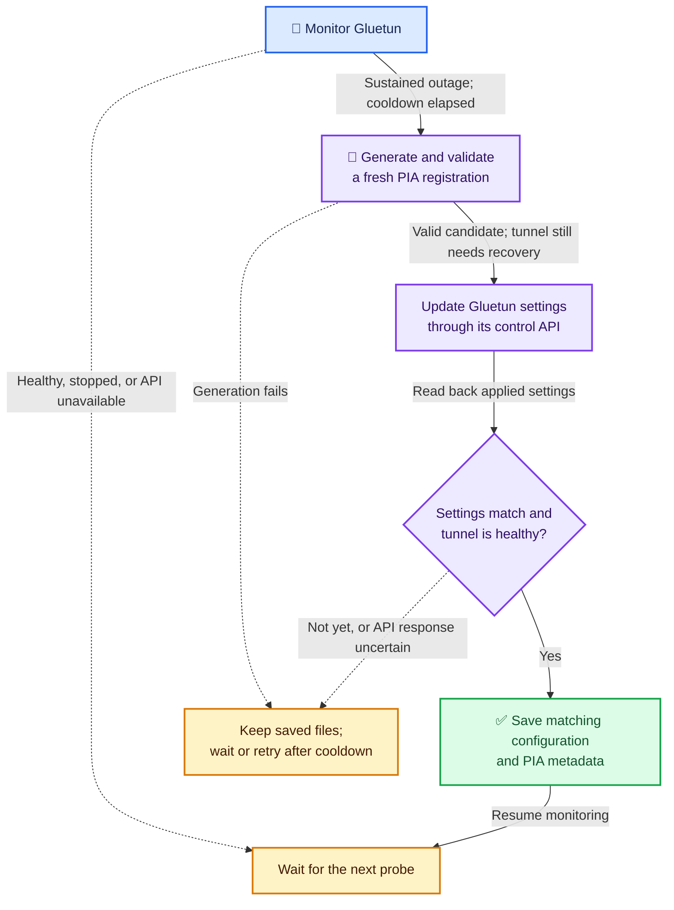

# Automatic Gluetun recovery 🧭

Privateerr can refresh a stale PIA WireGuard connection after a sustained tunnel outage. The supplied environment example enables it by default; configure its shared API key before starting. Privateerr remains a configuration generator; Gluetun still owns the tunnel, firewall, DNS, and port forwarding.

Recovery runs inside the existing Privateerr container and uses Gluetun's authenticated control API. It needs no additional service or Docker socket. The Gluetun container stays running, preserving the network namespace shared by applications such as qBittorrent. Existing connections may still disconnect while the tunnel changes.

## Configure recovery

Before you begin, use the updated Privateerr image, Compose file, and Gluetun entrypoint wrapper together. The integration is tested against Gluetun **v3.41.3**. Other versions must support the same authenticated control API routes and settings schema. The reference deployment keeps your chosen Gluetun image tag.

> [!IMPORTANT]
> Recovery makes Privateerr responsible for sustained-outage recovery and sets Gluetun's `HEALTH_RESTART_VPN=off`. Keep Privateerr outside Gluetun's VPN network namespace so it can reach PIA when the tunnel fails.

Follow these steps from the repository root:

1. Generate an API key:

   ```sh
   openssl rand -hex 24
   ```

2. Add the following settings to `.env`, replacing `YOUR-GENERATED-KEY` with that value:

   ```dotenv
   PRIVATEERR_AUTO_RECOVER=true
   PRIVATEERR_KEEPALIVE=true
   PRIVATEERR_GLUETUN_API_KEY=YOUR-GENERATED-KEY
   ```

3. Recreate the deployment so both containers receive the new environment:

   ```sh
   make up
   ```

4. Read Privateerr's logs:

   ```sh
   docker compose logs privateerr
   ```

   Confirm that you see `Automatic recovery enabled`, followed by `Gluetun tunnel is healthy` after startup.

## Configure a custom deployment

The supplied wrapper disables Gluetun's health-triggered restarts when recovery is enabled because those restarts can race a settings update. WireGuard still reconnects naturally after brief network interruptions. Do not publish Gluetun's control or health ports to the host for this feature.

The supplied Compose stack gives both containers a shared Docker network. When recovery is enabled, the Gluetun wrapper changes the default health listener from `127.0.0.1:9999` to `0.0.0.0:9999` and creates a temporary API authentication file with only the required routes. When recovery is disabled, the listener, authentication, and Gluetun restart policy remain unchanged.

For a custom deployment, adopt the updated wrapper or configure `HEALTH_RESTART_VPN=off`, the shared network, health listener, and API authentication yourself.

If an authentication file already exists at `/gluetun/auth/config.toml`, or `HTTP_CONTROL_SERVER_AUTH_CONFIG_FILEPATH` names a custom path, the wrapper preserves that file. Add a role with your shared key and these routes:

- `GET /v1/vpn/status`
- `GET /v1/vpn/settings`
- `PUT /v1/vpn/settings`
- `GET /v1/portforward`

Follow [Gluetun's authentication documentation](https://github.com/qdm12/gluetun-wiki/blob/main/setup/advanced/control-server.md#authentication). Settings responses contain secrets; do not paste them into support discussions.

## Choose a region

Automatic selection remains the default. To select the `ca` region, edit `.env`:

```dotenv
PIA_AUTOCONNECT=false
PIA_PREFERRED_REGION=ca
```

`PIA_PREFERRED_REGION` defaults to `ca`, matching Plundarr. Choose another PIA region ID to use that region instead. `PIA_AUTOCONNECT=true` takes precedence and ignores the preferred region. A container restart alone does not reload Compose environment changes; recreate with `make up`.

Recovery tries another advertised endpoint in the selected region. A pinned region never falls back to another region. Automatic selection prefers other endpoints in the current region, then other eligible regions in the server catalog; recovery does not rerun a full latency benchmark. With `PIA_PF=true`, only regions advertising port forwarding are eligible. If no unused endpoint remains, Privateerr attempts fresh registration against the current permitted endpoint. Dedicated IPs retain their dedicated endpoint through upstream setup.

## How the supervisor runs

A small Python supervisor runs in the existing Privateerr container. It uses the standard library to manage recovery state, validate connection settings, and call Gluetun. A shell adapter invokes the unmodified upstream PIA scripts; Gluetun's startup wrapper remains shell. There is no additional container, web server, or production Docker socket.

The supervisor measures elapsed time independently of the system date and time, so host clock corrections do not change outage thresholds or retry delays. It also bounds HTTP requests and PIA generation. See [recovery timing and resource limits](development/privateerr/architecture.md#bound-work-and-protect-credentials) for the implementation details. Container shutdown interrupts waits and stops the active generation process group. Existing environment variables, output paths, one-shot generation, and keepalive behavior remain available. Python test and lint tools stay in Buccaneerr.

The example uses `restart: unless-stopped` for Privateerr, Gluetun, and qBittorrent so Docker restarts exited services and brings them back after a host reboot unless you explicitly stopped them. This container policy is separate from tunnel recovery and does not restart a container merely because its healthcheck fails. Buccaneerr keeps `restart: "no"` so its test result remains final.

For one-shot generation, `make run-privateerr` disables recovery and keepalive for a disposable `docker compose run --rm` container; it exits after generation without changing `.env`. Stop the running supervisor before generating into the same configuration directory. Custom one-shot deployments should set `PRIVATEERR_AUTO_RECOVER=false`, `PRIVATEERR_KEEPALIVE=false`, and `restart: "no"`.

## Understand the recovery sequence

Privateerr generates and validates the initial configuration before reporting ready. Gluetun can therefore retain `depends_on: service_healthy`; Privateerr's Docker healthcheck does not depend on a working tunnel.

With recovery enabled, the monitor follows this sequence after the startup grace period. Blue marks monitoring, purple marks the settings handoff, green marks a verified save, and amber marks waiting or retrying. The arrow labels explain each transition.



Waiting returns to the next monitoring cycle. Before retrying an uncertain update, Privateerr checks what Gluetun actually applied; it does not immediately generate another candidate.

After the startup grace period, Privateerr checks Gluetun's control API and tunnel health. A sustained outage triggers one fresh PIA registration. Generation uses staging files and a deadline, leaving saved configuration untouched on failure. The upstream PIA scripts remain unmodified.

Privateerr submits the new WireGuard keys, address, endpoint, and PIA server name together through `PUT /v1/vpn/settings`. Gluetun restarts its internal tunnel. Privateerr reads back the applied settings and waits for tunnel health before saving the new configuration and metadata. An ambiguous API timeout is reconciled before another candidate is generated. Pending candidates and an interrupted publication can be recovered after Privateerr restarts.

Privateerr reports port-forwarding status separately. Gluetun continues obtaining and renewing the forwarded port; a forwarding-only failure does not cause Privateerr to rotate otherwise healthy tunnels. Existing application port-update hooks remain Gluetun's responsibility.

## Configure timing

The table lists defaults from `example.env`. When upgrading the repository Compose deployment, add missing variables to your existing `.env`; Compose deliberately supplies no fallback values. Custom deployments that omit these settings use the image defaults, with recovery disabled unless explicitly enabled.

| Variable | Default | Purpose |
| --- | --- | --- |
| `PRIVATEERR_AUTO_RECOVER` | `true` in the environment example | Enable the recovery monitor |
| `PRIVATEERR_GLUETUN_URL` | `http://gluetun:8000` | Authenticated control API |
| `PRIVATEERR_GLUETUN_HEALTH_URL` | `http://gluetun:9999` | Tunnel health endpoint |
| `PRIVATEERR_RECOVERY_INTERVAL_SECONDS` | `30` | Seconds between probes |
| `PRIVATEERR_RECOVERY_FAILURE_SECONDS` | `120` | Startup grace and continuous failure threshold, in seconds |
| `PRIVATEERR_RECOVERY_COOLDOWN_SECONDS` | `300` | Initial seconds between attempts; doubles on failures up to one hour |
| `PRIVATEERR_GENERATION_TIMEOUT_SECONDS` | `180` | Maximum seconds for each upstream generation |

At startup, Privateerr waits through the grace period before monitoring. Recovery then requires a continuous failure lasting the configured threshold, measured from an unhealthy probe. Gluetun's own periodic probes and retries add detection time, so a blocked endpoint can take several minutes to trigger recovery. Healthy probes reset the failure timer. A manually stopped VPN pauses recovery. Failed API authentication or an unreachable control server does not cause repeated configuration generation.

## Compatibility and limits

The repository environment example enables recovery by default. The image itself retains recovery-disabled behavior when `PRIVATEERR_AUTO_RECOVER` is omitted, preserving existing custom deployments. When upgrading this repository's Compose deployment, copy missing variables from `example.env` into your existing `.env` and configure a private shared API key. Preserve your credentials and paths; Compose contains no fallback defaults. An explicitly selected region requires `PIA_AUTOCONNECT=false`; the new default removes the need for interactive region selection when no preference was supplied.

Recovery requires the configuration and metadata to share a directory mount and one Privateerr instance to own those files. The existing `wg0.conf` and `privateerr.env` paths remain regular files. Privateerr keeps copies of both files in `.privateerr-commit` until both replacements finish, allowing startup to complete an interrupted save. It stores a candidate awaiting API and health confirmation in `.privateerr-pending`. Both directories sit beside the generated files. Do not delete those directories during recovery. A normal one-shot regeneration still replaces saved files; avoid running it concurrently with the monitor.

This feature cannot start a stopped Gluetun container or repair a hung Docker daemon. An unavailable PIA service, invalid account credentials, or a fully unavailable pinned region can also prevent recovery. Logs identify those failures while the saved configuration remains available. Repeated failures use a cooldown rather than a container restart loop.

## Run without privileged mode

The example runs Privateerr with all Linux capabilities dropped and `no-new-privileges` enabled. UID 0 remains necessary because the unmodified upstream PIA scripts explicitly require it. Gluetun owns the VPN interface and retains its separate `NET_ADMIN` capability; Privateerr only generates configuration and calls the control API.

`PRIVATEERR_IPV6_DISABLED=1` makes Docker disable IPv6 in Privateerr's network namespace before startup. It does not change host or Gluetun settings. Keep the default alongside `PIA_DISABLE_IPV6=yes`: the wrapper checks both namespace settings and skips redundant upstream writes when Docker has already applied them. No warning output is filtered. If IPv6 is still enabled, the original upstream behavior remains available to existing privileged deployments.

An image-only update, including Watchtower, retains the existing container options. It does not remove old privileges, add these sysctls, or enable recovery when `PRIVATEERR_AUTO_RECOVER` was absent. Adopt the new Compose settings and recreate Privateerr to obtain the hardening. Copy the new environment setting from `example.env` before recreation and keep configuration directories writable by the container's UID 0. These settings support configuration generation with `PIA_CONNECT=false`; Privateerr does not run the tunnel.

The supplied VPN services carry labels disabling unattended Watchtower updates. If an operator enables automatic updates in a custom deployment, image replacement still interrupts that container briefly. Use a release containing the updated wrapper before applying the hardened Compose configuration; an older image can still attempt the redundant sysctl writes and log errors.

## Disable recovery

Set `PRIVATEERR_AUTO_RECOVER=false` in `.env` and recreate both containers with `make up`. Gluetun resumes its configured health-restart policy. Privateerr returns to ordinary startup behavior and generates a fresh configuration pair.

## Compare with the discussion's watchdog setup

[Discussion #66](https://github.com/scottgigawatt/privateerr/discussions/66) demonstrates a working operator strategy: combine tunnel health with Privateerr readiness, let deunhealth restart unhealthy containers through the Docker socket, stagger Privateerr and Gluetun failure thresholds, and restart qBittorrent when its internet probe fails.

| Scenario | Discussion setup | Privateerr supervisor |
| --- | --- | --- |
| Stale PIA registration or endpoint | Restart Privateerr to generate new files, then rely on tunnel or container restart | Generate a validated replacement and explicitly apply it through Gluetun's API |
| Healthy process with an unusable tunnel | Escalate through timed health failures | Require sustained failure, then reconcile settings and tunnel health |
| Gluetun container replacement | qBittorrent's internet check can trigger a restart to rejoin networking | Preserve the existing namespace by changing only the internal VPN connection |
| Hung container or stopped service | deunhealth can restart a running unhealthy container; restart policy handles exited processes | Outside supervisor scope; no Docker socket or container lifecycle authority |
| Intentional VPN stop | Tunnel-dependent health checks may trigger watchdog intervention | Pause recovery while the API reports the VPN stopped |
| Port forwarding | Gluetun obtains the lease and updates qBittorrent through hooks | Same ownership; a forwarding-only failure does not rotate a healthy VPN |

The watchdog covers more container-level failures, at the cost of Docker socket access and coordinated restart timing. The supervisor focuses on the stale-PIA problem while keeping recovery inside Privateerr. Rewriting `wg0.conf` is not treated as proof that a running Gluetun has loaded it: the supervisor applies all changed connection fields through the API and verifies the result.

Docker health status alone does not restart a container. Also, [`depends_on.restart: true`](https://docs.docker.com/reference/compose-file/services/#depends_on) follows explicit Compose operations; it does not propagate every Docker runtime restart. If an operator recreates Gluetun outside Compose, dependent applications may still need recreation. Privateerr cannot repair that condition without acquiring container-management privileges, which this design intentionally avoids.

The bounded forwarding hook reports failed application updates. If qBittorrent stays unavailable longer than its configured wait, restore the application and reapply the current port with the hook or restart forwarding. There is no extra application watchdog. The live suite verifies qBittorrent's actual preferences, continued container identity, VPN egress, and incoming TCP through the PIA lease; it does not claim UDP reachability or torrent download throughput.

## Try the qBittorrent example

The root Compose file is a complete development and test example: Privateerr generates configuration, Gluetun creates the VPN namespace, qBittorrent runs inside it, and Buccaneerr validates the application and automatic recovery. All four services start by default. Configure these values in `.env`:

```dotenv
QBITTORRENT_PORT_SYNC=true
QBITTORRENT_WEBUI_PORT=8080
QBITTORRENT_API_WAIT_SECONDS=300
```

Set `QBITTORRENT_PUID`, `QBITTORRENT_PGID`, and the configuration/download paths from `example.env` to match the host. Then start the application and its dependencies:

```sh
make test-e2e
```

The Web UI is published on the Docker host at the port selected by `QBITTORRENT_WEBUI_PORT` (8080 by default). Changing that value also updates the internal listener, healthcheck, forwarding hook API URL, and Buccaneerr checks. LinuxServer [recommends matching both sides of the port mapping and `WEBUI_PORT`](https://docs.linuxserver.io/images/docker-qbittorrent/#webui) because mismatched ports can cause CSRF and login problems. Keep those ports synchronized rather than fixing the container side at `8080`. The Gluetun API and health listener remain unpublished. Set `QBITTORRENT_WEBUI_PORT` in `.env` if port 8080 is already in use.

The seed configuration allows unauthenticated API access only from loopback, where Gluetun's hook runs. Remote Web UI sessions still require authentication; obtain the initial password from qBittorrent's local container logs and change it in the Web UI. Do not share those logs. Other containers deliberately sharing Gluetun's namespace also share that loopback trust boundary.

The hook binds qBittorrent to the VPN interface and assigned port, with random ports and UPnP disabled. On lease removal it binds to loopback. An existing application configuration is not overwritten; ensure its localhost API access permits the hook. VPN peer ports do not need host publication.

Run the isolated application and API check without PIA credentials, or the full recovery test with your local credentials:

```sh
make test-recovery-api
make test-recovery-live
```

Both drivers and their tools run inside Buccaneerr. Tests create labeled temporary Gluetun and qBittorrent containers, clean up only their own resources, and do not start the root example or download torrents. LinuxServer's current qBittorrent image supports amd64 and arm64; the application is not part of Privateerr's arm/v7 image support.

Buccaneerr waits for a healthy qBittorrent Web UI, verifies the assigned VPN port and interface, and briefly blocks the active VPN endpoint when `BUCCANEERR_TEST_RECOVERY=true` (the example default). It requires a new registration, healthy tunnel, matching saved configuration, and restored application settings before reporting success. Its `NET_ADMIN` capability applies only inside the demo VPN namespace; it needs no Docker socket and removes its own firewall rule on completion or failure. The default recovery deadline is 600 seconds, including Gluetun's health-detection delay.

This deliberate outage is part of the test example. Set `BUCCANEERR_TEST_RECOVERY=false` for a connectivity-only run. To use the example as a lasting application deployment, start `privateerr gluetun qbittorrent` explicitly and run Buccaneerr only when testing. `make build` and `make build-buccaneerr` still build only their respective images.
