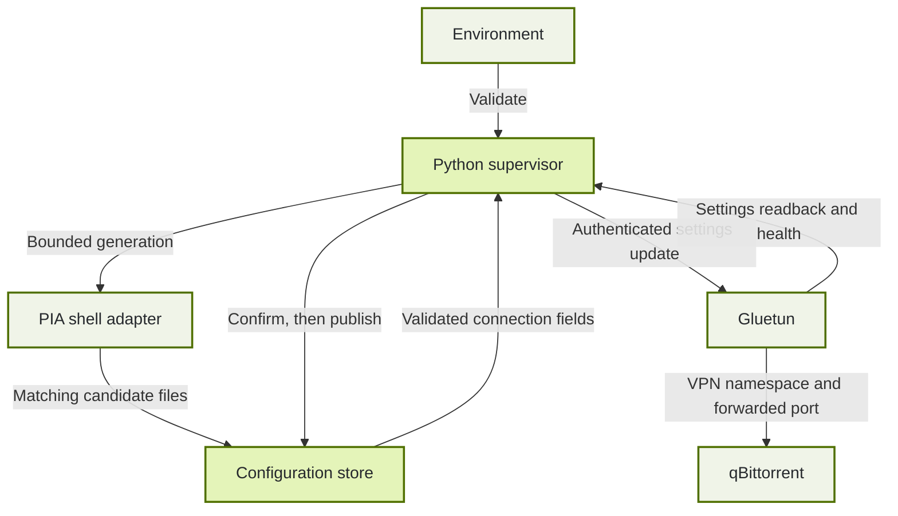

# Supervisor architecture ⚙️

Privateerr separates configuration generation from tunnel ownership. Its single-threaded supervisor calls the existing PIA scripts, validates their output, and applies a small connection update through Gluetun's authenticated API. Gluetun keeps its network namespace throughout recovery, so qBittorrent remains attached to the same container network.

## Follow the data

The supervisor reads environment settings once at startup. Configuration generation runs in a separate process group and a private staging directory. Only validated connection fields are sent to Gluetun; its unrelated DNS, firewall, and provider settings remain intact.

## Separate readiness from tunnel health

Startup first completes any interrupted file publication. With recovery enabled, an existing valid configuration pair can be reused; otherwise Privateerr generates and saves one. The readiness marker then allows Gluetun to start. It means that valid files exist, not that the VPN is healthy, avoiding a circular startup dependency.

Recovery begins after the startup grace period. Every probe checks control API access, intentional stop state, pending updates, and tunnel health before considering another registration. A sustained failure must exceed the configured threshold and retry cooldown. Healthy probes reset the failure timer and retry delay.

## Confirm updates before saving

A settings update can succeed even if its HTTP response is lost. Privateerr therefore retains a complete candidate before submitting it, then reads back Gluetun's active settings. Matching connection fields and a healthy tunnel are both required before replacing saved configuration.

| Directory or file | Meaning | Lifetime |
| :--- | :--- | :--- |
| `.privateerr-stage.*` | Temporary generation output | Removed when the generation context exits |
| `.privateerr-pending` | Candidate awaiting API and health confirmation | Retained across uncertain updates and process restarts |
| `.privateerr-commit` | Complete source copies for interrupted publication | Removed after both saved files have been replaced |
| `wg0.conf` and `privateerr.env` | Matching published connection and PIA metadata | Consumed when Gluetun starts |

Each file replacement is atomic, but the pair is not one filesystem transaction. The commit directory retains both source files so startup can finish an interrupted save. The `ready` marker is written only after both copies validate; incomplete copies cannot be mistaken for a usable candidate.

## Bound work and protect credentials

HTTP requests have a total deadline and a response-size limit. Redirects are rejected, inherited HTTP proxies are ignored, and only control requests receive the API key. External JSON remains untrusted until its structure and fields are validated. Generated metadata is parsed as data rather than executed as shell code.

The supervisor uses a monotonic clock for outage and retry timing. PIA generation has a deadline; shutdown interrupts waiting and stops the generation process group. New files use a restrictive umask, and logs omit credentials, keys, and response bodies.

## Respect recovery limits

Pinned deployments stay within the selected region. Automatic selection prefers untried endpoints in the saved region, then other eligible regions. Port-forwarding deployments require eligible regions; dedicated-IP selection stays with upstream PIA setup.

An unavailable control API, intentionally stopped VPN, or forwarding-only failure does not trigger blind regeneration. Privateerr does not restart containers or repair Docker. Gluetun remains responsible for the port lease and qBittorrent update hooks. See the [recovery sequence and limitations](../../automatic-recovery.md#understand-the-recovery-sequence) for operator-facing behavior.
