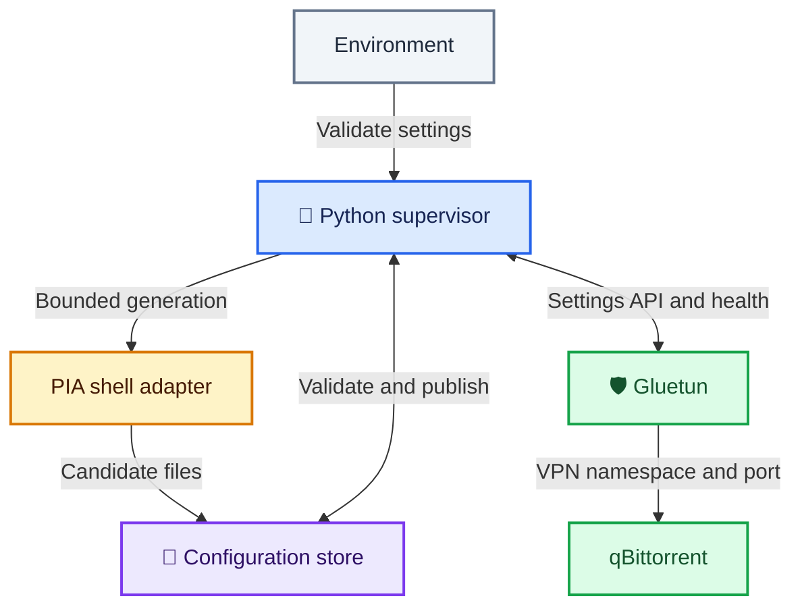

# Supervisor architecture ⚙️

Privateerr separates configuration generation from tunnel ownership. Its single-threaded supervisor calls the existing PIA scripts, validates their output, and applies a small connection update through Gluetun's authenticated API. Gluetun keeps its network namespace throughout recovery, so qBittorrent remains attached to the same container network.

## Follow the data

Blue marks the supervisor, amber marks upstream generation, purple marks saved and staged files, and green marks the VPN and application. The two-way API arrow covers authenticated settings updates, settings readback, and health probes. The storage arrow covers reading validated candidates and publishing them after confirmation.

The supervisor reads environment settings once at startup. Configuration generation runs in a separate process group and a private staging directory. Only validated connection fields are sent to Gluetun; its unrelated DNS, firewall, and provider settings remain intact.

## Separate readiness from tunnel health

Startup first completes any interrupted file publication. With recovery enabled, an existing valid configuration pair can be reused; otherwise Privateerr generates and saves one. The startup marker, `/healthcheck/privateerr.ready` by default, then allows Gluetun to start. `PRIVATEERR_HEALTHCHECK_MARKER` can change its path. It means that valid files exist, not that the VPN is healthy, avoiding a circular startup dependency.

Recovery begins after the startup grace period. Every probe checks control API access, intentional stop state, pending updates, and tunnel health before considering another registration. A sustained failure must exceed the configured threshold and retry cooldown. Healthy probes reset the failure timer and retry delay.

## Confirm updates before saving

A settings update can succeed even if its HTTP response is lost. Privateerr therefore retains a complete candidate before submitting it, then reads back Gluetun's active settings. Matching connection fields and a healthy tunnel are both required before replacing saved configuration.

All paths below except the startup marker are relative to the shared configuration directory, `/gluetun/wireguard` in the example deployment.

| Directory or file | Meaning | Lifetime |
| :--- | :--- | :--- |
| `.privateerr-stage.*` | Temporary output from one PIA generation | Removed when generation completes, fails, or is interrupted |
| `.privateerr-pending/` | Candidate awaiting API and health confirmation | Retained across uncertain updates and process restarts; removed after acceptance or rejection |
| `.privateerr-commit/` | Complete source copies for interrupted publication | Removed after both saved files have been replaced |
| `ready` inside `.privateerr-pending/` or `.privateerr-commit/` | Both copied files have passed validation | Written last; removed with its containing directory |
| `settings.json` inside those same directories | Validated connection fields recorded alongside the copied files | Retained and removed with its containing directory; contains private key material |
| `wg0.conf.new` or `privateerr.env.new` | Temporary replacement of one published file | Renamed over its destination during publication; an interrupted replacement is rewritten on resume |
| `wg0.conf` and `privateerr.env` | Matching published connection and PIA metadata | Retained for Gluetun startup until a verified replacement or explicit regeneration |
| `/healthcheck/privateerr.ready` | Startup validation has produced a usable saved pair | Cleared at Privateerr startup and recreated after validation; unrelated to current tunnel health |

Each file replacement is atomic, but replacing the pair is not one filesystem transaction. The commit directory retains both source files so startup can finish an interrupted save. Its `ready` file, and the equivalent file in the pending directory, identify complete validated copies. They are separate from the startup healthcheck marker. A directory without its `ready` file is an incomplete copy and is discarded instead of applied.

## Bound work and protect credentials

HTTP requests have a total deadline and a response-size limit. Redirects are rejected, inherited HTTP proxies are ignored, and only control requests receive the API key. External JSON remains untrusted until its structure and fields are validated. Generated metadata is parsed as data rather than executed as shell code.

The supervisor measures outage and retry intervals with a **monotonic clock**: an elapsed-time counter that only moves forward and is unaffected by changes to the system date or time. Correcting the host clock therefore cannot shorten a recovery cooldown or make an outage appear older. These timers start afresh when the supervisor process restarts; retained candidate files are reconciled separately. PIA generation has a deadline; shutdown interrupts waiting and stops the generation process group. New files use a restrictive umask, and logs omit credentials, keys, and response bodies.

## Respect recovery limits

Pinned deployments stay within the selected region. Automatic selection prefers untried endpoints in the saved region, then other eligible regions. Port-forwarding deployments require eligible regions; dedicated-IP selection stays with upstream PIA setup.

An unavailable control API, intentionally stopped VPN, or forwarding-only failure does not trigger blind regeneration. Privateerr does not restart containers or repair Docker. Gluetun remains responsible for the port lease and qBittorrent update hooks. See the [recovery sequence and limitations](../../automatic-recovery.md#understand-the-recovery-sequence) for operator-facing behavior.
